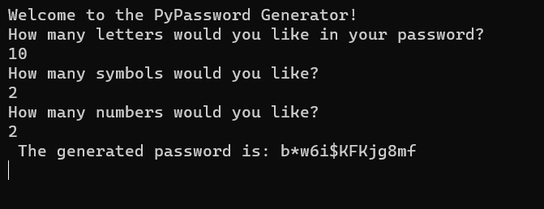

# PyPassword Generator

Generate secure passwords with this Python script using a mix of letters, numbers, and symbols based on user-defined criteria.

## Usage

1. **Clone the repository:**

    ```bash
    git clone https://github.com/jaiswalism/password-generator.git
    ```

2. **Run the script:**

    ```bash
    cd password-generator
    python password_generator.py
    ```

3. **Follow the on-screen prompts to specify the composition of your password.**

## Configuration

- Adjust character sets (`letters`, `numbers`, `symbols`) in the script.
- Customize the script as needed.

## Example Images


*Screenshot*

## License

This project is licensed under the [MIT License](LICENSE).

Feel free to contribute, report issues, or suggest improvements!
